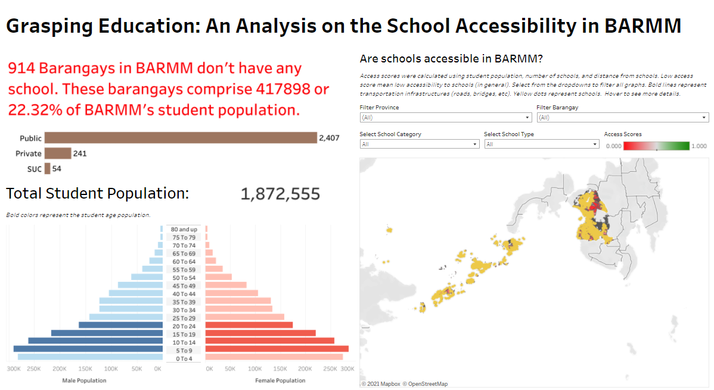

# Sages BARMM

## Title

*Dashboard & Predictive Model*, SAGES: Sustainable Accessibility and Geographics of Education and Schools in BARMM

## Abstract

Education is every child's right. But for some Filipino families, this right is a privilege. A privilege that only those who have the means can access. Being abled Filipinos, we have the responsibility to step forward and provide positive changes by any means we can. No child should be left behind.

Education gives hope that generations of poverty will end in poor families. But this route out of poverty has many blockers which include school accessibility and financial capability. Poor students are not able to afford transportation to school. Other schools are not even accessible by roads. Students in rural areas would risk their lives just to go to school. Some would stop studying because of the far distance from school. Their everyday way to school is hard enough. Their way out of poverty is even harder. We need to ensure everyone has access to schools to alleviate poverty. 

The lack of access to learning facilities is evident nationally, including the BARMM. This project aims to analyze and assess the accessibility of education in BARMM demographically and geographically. This project will create an analytics dashboard for policymakers utilizing different BARMM open data from tabular to geodata. This project will also utilize statistical techniques and machine learning models that can be used to identify potential locations for school development and building projects.

Helping BARMM make better decisions about education will provide more equal opportunities to as many students as possible, giving them a chance for a better future.

## Output
* Preview: 

* [Presentation Video](https://www.youtube.com/watch?v=hHW_6XvkzSM)
* [Pitch Deck](https://www.canva.com/design/DAETkfTyyMs/ZFWmHTW5kWI0kAIV1UiuRA/view)
* [Dashboard Prototype](https://public.tableau.com/profile/myra.saet8551#!/vizhome/BARMMEducv4/Dashboard1)